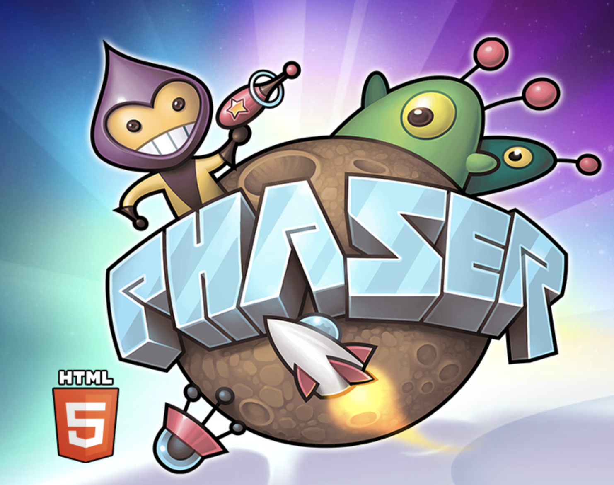
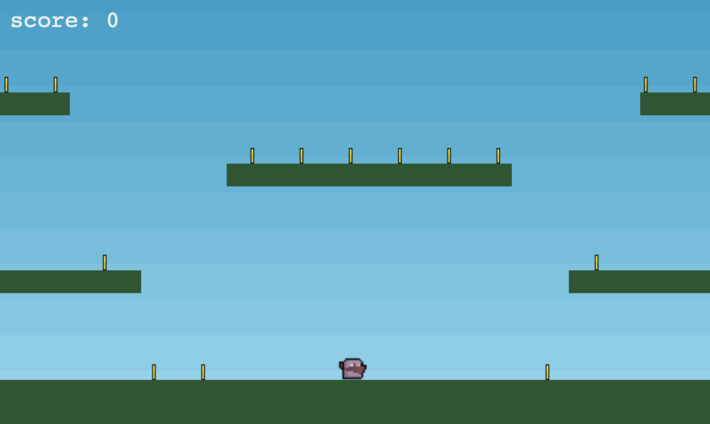
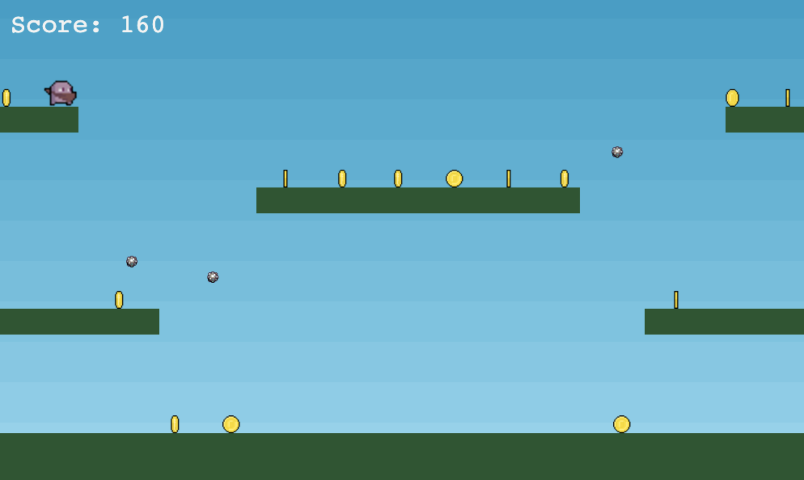
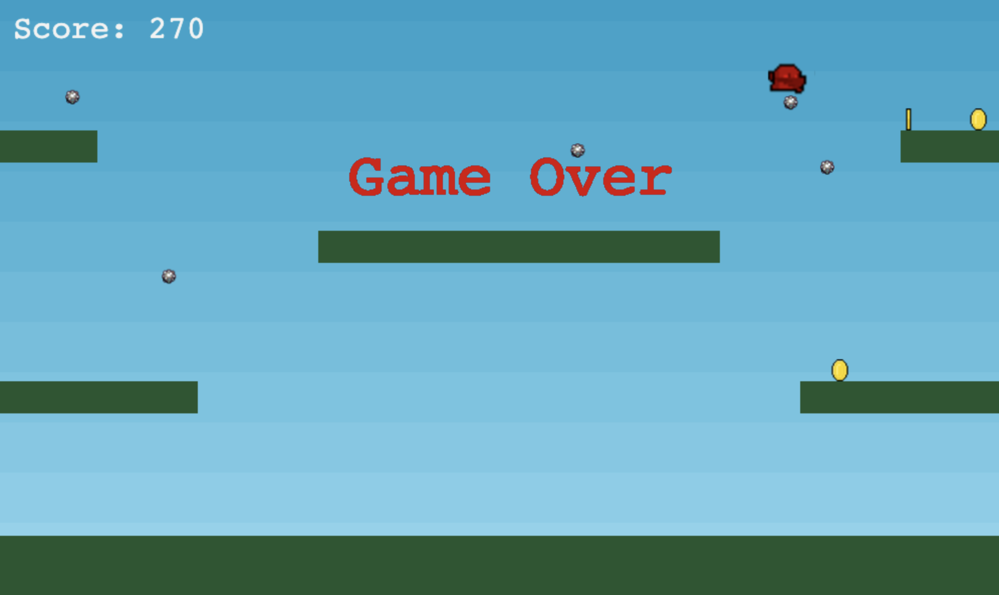

# GAME USING PHASER3

This "Jump & Run" game developed using [PHASER 3](https://phaser.io/), which is a free and fun open sorce framework for [Canvas](https://developer.mozilla.org/en-US/docs/Web/API/Canvas_API) and [WebGL](https://developer.mozilla.org/en-US/docs/Web/API/WebGL_API) powered browser games.

## Functionality

In a simple but a really fun way, [PHASER 3](https://phaser.io/) explains how to develop your game using different features like animations and physics from different libraries like [matter.js](https://brm.io/matter-js/) and [arcade.js](https://github.com/mar10/arcade-js#:~:text=ArcadeJS%20is%20a%202d%20game,of%20the%20Rip%2DOff%20game.).

The target in this game is to collect as many coins as possible using the coursors "right" and "left" to move in the "X" axis, and the coursor "up" to jump over the platforms ("Y" axis).

every time the player collects a coin, the score will increase 10 points.

and if the player touchs a bomb, the game will finish showing a message "Game Over":

That's it!, enjoy playing my game and don't hesitate to have a look in the code.

### Sources

[PHASER 3](https://phaser.io/)

[itch.io](https://itch.io/search?q=mini+characters) Animated mini carachters.

[Photopea](https://www.photopea.com/)
